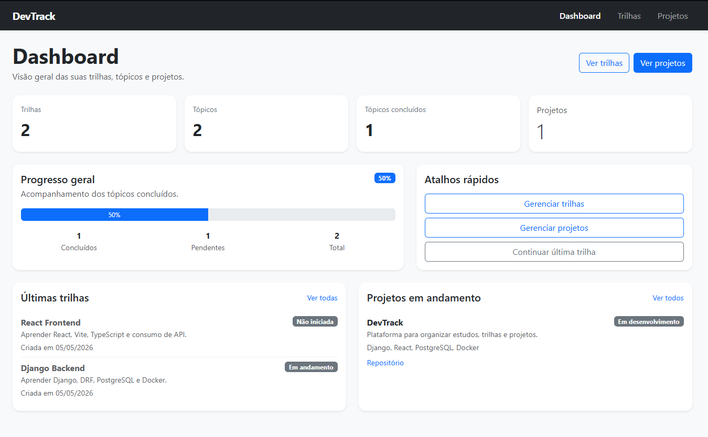
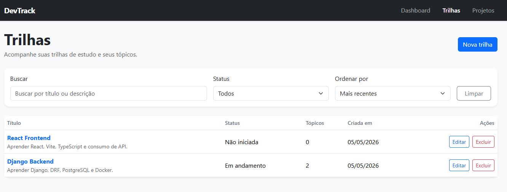
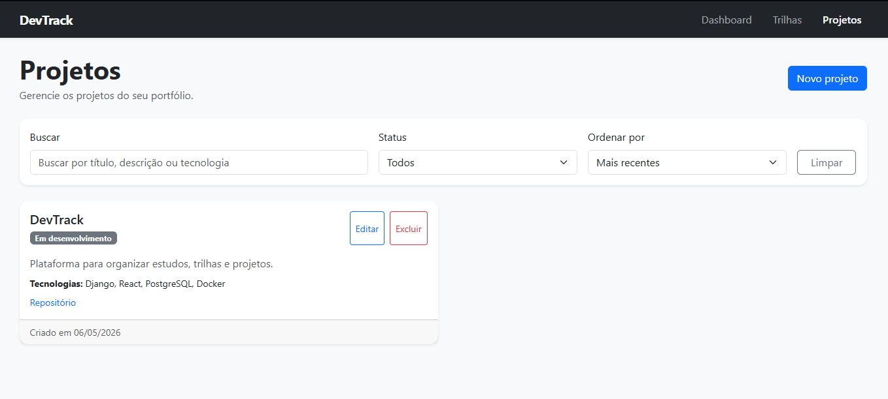

# DevTrack

DevTrack é uma aplicação fullstack para organizar trilhas de estudo, tópicos de aprendizado e projetos de portfólio para desenvolvedores.

O projeto foi criado com o objetivo de praticar desenvolvimento fullstack utilizando Django no backend, React no frontend, PostgreSQL como banco de dados e Docker para conteinerização do ambiente.

## Funcionalidades

- Dashboard com resumo geral da evolução
- Cadastro, edição, listagem e exclusão de trilhas de estudo
- Cadastro, edição, conclusão e exclusão de tópicos dentro de uma trilha
- Cadastro, edição, listagem e exclusão de projetos de portfólio
- Filtros, busca e ordenação em trilhas
- Filtros, busca e ordenação em projetos
- Modal de confirmação para exclusões
- Interface responsiva com Bootstrap
- API REST com Django REST Framework
- Banco de dados PostgreSQL
- Ambiente com Docker Compose

## Tecnologias utilizadas

### Backend

- Python
- Django
- Django REST Framework
- django-filter
- django-cors-headers
- PostgreSQL
- python-decouple

### Frontend

- React
- Vite
- TypeScript
- Axios
- React Router
- Bootstrap

### Infraestrutura

- Docker
- Docker Compose
- PostgreSQL em container

## Arquitetura do projeto

```txt
devtrack/
├── backend/
│   ├── config/
│   ├── dashboard/
│   ├── projects/
│   ├── topics/
│   ├── tracks/
│   ├── Dockerfile
│   ├── manage.py
│   └── requirements.txt
│
├── frontend/
│   ├── src/
│   │   ├── api/
│   │   ├── components/
│   │   ├── hooks/
│   │   ├── pages/
│   │   ├── types/
│   │   └── utils/
│   ├── Dockerfile
│   └── package.json
│
├── docker-compose.yml
├── .env.example
└── README.md
```

## Como rodar com Docker

Crie um arquivo `.env` na raiz do projeto com base no `.env.example`.

Depois rode:

```bash
docker compose up --build
```

Em outro terminal, aplique as migrations:

```bash
docker compose exec backend python manage.py migrate
```

Para criar um superusuário:

```bash
docker compose exec backend python manage.py createsuperuser
```

Acesse:

```txt
Frontend: http://localhost:5173
Backend: http://localhost:8000
Admin Django: http://localhost:8000/admin
```

## Como rodar localmente

### 1. Subir o banco de dados

Na raiz do projeto, rode:

```bash
docker compose up -d postgres
```

### 2. Criar e ativar o ambiente virtual

Na raiz do projeto:

```bash
python -m venv .venv
```

No Windows PowerShell:

```bash
.\.venv\Scripts\Activate.ps1
```

### 3. Configurar o backend

Entre na pasta do backend:

```bash
cd backend
```

Instale as dependências:

```bash
pip install -r requirements.txt
```

Crie um arquivo `.env` dentro da pasta `backend` com base no arquivo `backend/.env.example`.

Rode as migrations:

```bash
python manage.py migrate
```

Inicie o backend:

```bash
python manage.py runserver
```

### 4. Configurar o frontend

Em outro terminal, entre na pasta do frontend:

```bash
cd frontend
```

Instale as dependências:

```bash
npm install
```

Inicie o frontend:

```bash
npm run dev
```

Acesse:

```txt
Frontend: http://localhost:5173
Backend: http://localhost:8000
```

## Endpoints principais

### Dashboard

```txt
GET /api/dashboard/summary/
```

### Trilhas

```txt
GET    /api/tracks/
POST   /api/tracks/
GET    /api/tracks/{id}/
PUT    /api/tracks/{id}/
DELETE /api/tracks/{id}/
```

### Tópicos

```txt
GET    /api/topics/
POST   /api/topics/
GET    /api/topics/{id}/
PUT    /api/topics/{id}/
DELETE /api/topics/{id}/
```

### Projetos

```txt
GET    /api/projects/
POST   /api/projects/
GET    /api/projects/{id}/
PUT    /api/projects/{id}/
DELETE /api/projects/{id}/
```

## Exemplos de filtros

### Trilhas

```txt
GET /api/tracks/?search=django
GET /api/tracks/?status=in_progress
GET /api/tracks/?ordering=title
```

### Projetos

```txt
GET /api/projects/?search=react
GET /api/projects/?status=in_progress
GET /api/projects/?ordering=-created_at
```

### Tópicos

```txt
GET /api/topics/?track=1
GET /api/topics/?completed=true
GET /api/topics/?ordering=order
```

## Aprendizados

Durante o desenvolvimento deste projeto, foram praticados conceitos como:

- Criação de APIs REST com Django REST Framework
- Modelagem de dados relacionais com Django ORM
- Relacionamento entre trilhas e tópicos
- Migrations com Django
- Integração com PostgreSQL
- Consumo de API com React e Axios
- Rotas dinâmicas com React Router
- Tipagem com TypeScript
- Componentização no frontend
- Criação de hooks customizados
- Filtros, busca e ordenação em APIs
- Uso de Docker e Docker Compose
- Separação entre backend e frontend

## Próximas melhorias

- Autenticação de usuários
- Cada usuário visualizar apenas suas próprias trilhas e projetos
- Deploy do backend
- Deploy do frontend
- Testes automatizados no backend
- Testes automatizados no frontend
- Paginação na API
- Melhorias visuais no dashboard
- Upload de imagens para projetos
- Tela pública de portfólio

## Screenshots

### Dashboard



### Trilhas



### Projetos



## Status do projeto

Em desenvolvimento.